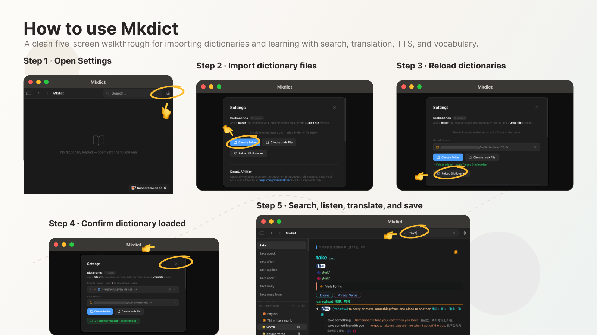

# Mkdict — Your Personal Offline Dictionary

> A blazing-fast, offline-first MDX dictionary reader built for serious language learners. Explore instant local lookups, natural TTS pronunciation, and seamless sentence translation. Effortlessly organize your vocabulary with smart collections, with full support for importing vocabulary and exporting to JSON or Markdown.

---

## ✨ Features

### 📖 Dictionary
- Load any **MDX/MDD dictionary files** — Oxford, Collins, Larousse, and more
- Support for **multiple dictionaries simultaneously** with tabbed switching
- Instant word lookup with **full definition rendering** — phonetics, examples, images, audio
- **Click any word** inside a definition to look it up instantly
- **History navigation** — back and forward like a browser
- Drag to **reorder dictionaries** in the tab bar

### 🔊 Pronunciation
- **Native TTS pronunciation** using macOS `say` command (Mac) or Windows SAPI (Windows)
- Supports **English, French, German, Japanese, Spanish, Korean, Portuguese, Italian, Russian, Arabic, Chinese**
- **Audio playback** from embedded MDD audio files
- Phrasal verbs automatically get their own voice button

### 🌐 Sentence Translation
- **Auto-detects sentences** — type or paste any sentence to translate instantly
- **Free auto-translation** via MyMemory (no API key needed)
- Optional **DeepL, Gemini, and ChatGPT** integration for comparison
- Translate to **10 languages** — Chinese (Simplified & Traditional), French, German, Japanese, Spanish, Korean, Portuguese, Italian, Russian, Arabic
- **Compare translations** side by side from multiple providers
- **Listen to translations** in the target language

### 📚 Vocabulary Collections
- **Save words, phrasal verbs, and sentences** to organized folders and files
- Custom **emoji icons** for folders and files
- **Drag to reorder** folders and files
- **Import words** from a list or exported `.md` file
- **Export as `.md`** — individual files or entire folders at once
- Exported sentences include **cached translation and personal notes**
- Export/import entire collection as **JSON backup**
- Smart **backup reminder** every 50 saved words

### 📝 Notes
- Add **personal notes** to any saved sentence
- Notes saved locally and included in exports
- Auto-expanding note textarea

### 🔍 Smart Search
- **Chinese/Vietnamese/Thai input** — auto-translates to English for lookup
- **Exact match** detection and instant selection
- Debounced search with **800ms delay** for smooth typing

---

## 📥 Download

Download the latest version from the [**Releases**](../../releases) page.

| Platform | File             | Architecture          |
|----------|------------------|-----------------------|
| macOS    | `.dmg`           | Apple Silicon (ARM64) |
| Windows  | `.msi` or `.exe` | x64                   |
| Linux    | `.AppImage`      | x64                   |

---

## 🚀 Getting Started

### 1. Install the app
Download and install the appropriate file for your platform from the Releases page.

### 2. Add your dictionaries
Click the **Settings** gear icon (top right) → **Choose Folder** to add a folder containing your `.mdx` files, or **Choose .mdx File** to add a single dictionary.

Click **Reload Dictionaries** after adding.

### 3. Start looking up words
Type any word in the search bar. Results appear instantly from all loaded dictionaries.

---

## 📖 Dictionary Files

Mkdict supports **MDX/MDD format** dictionaries. Popular sources:

- [FreeMdict Forum](https://forum.freemdict.com) — large collection of free MDX dictionaries
- [MDict Official](https://www.mdict.cn) — official MDict resources
- Oxford, Collins, Larousse dictionaries in MDX format

Place your `.mdx` and `.mdd` files in the same folder and add the folder in Settings.

---

## 🌐 Translation Setup (Optional)

MK Dict includes **free auto-translation** via MyMemory with no setup required.

For higher quality or comparison translations, add API keys in Settings:

| Provider | Cost | Get Key |
|----------|------|---------|
| **MyMemory** | Free, no key needed | Built-in |
| **DeepL** | Free tier — 500k chars/month | [deepl.com/pro](https://deepl.com/pro#developer) |
| **Gemini** | Free, no credit card | [aistudio.google.com](https://aistudio.google.com) |
| **ChatGPT** | ~$0.01 per 1000 sentences | [platform.openai.com](https://platform.openai.com) |

---

## How to use

## ☕ Support

If Mkdict saves you time and helps your language learning, consider buying me a coffee!

[!\[ko-fi\]\(https://ko-fi.com/mkdict\)](https://ko-fi.com/mkdict)

Every coffee helps keep this project maintained and improved. 🙏

---

## 📄 License

MIT License — free to use, modify, and distribute.
